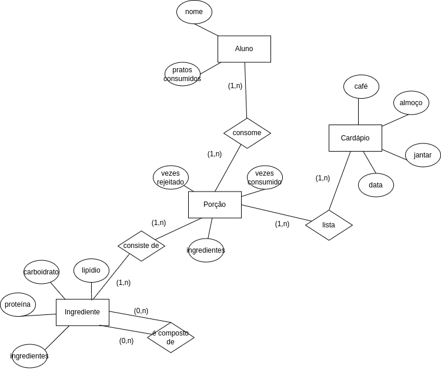

# Equipe Yvensíveis

# Subgrupo A
* Pedro César Mesquita Ferreira - 183998
* Yvens Ian Prado Porto - 184031
* Lucca Miranda Nunes - 230554

## Modelo Conceitual ER Revisado

*Diagrama ER Revisado*

## Mapeamento para o Modelo Relacional

~~~
LISTA(_Data Cardápio_, Refeição, ID Porção)
    ID Porção chave estrangeira -> Porção (ID Porção)
CONSOME(_ID Aluno_, _Data_, ID Porção)
    ID Porção chave estrangeira -> Porção (ID Porção)
PORÇÃO (_ID Porção_, Vezes Rejeitado, Vezes consumido, Componentes Ingredientes)
COMP_PORÇÃO (ID Porção, ID Ingrediente)
    ID Porção chave estrangeira -> Porção (ID Porção)
    ID Ingrediente chave estrangeira -> Ingrediente (ID Ingrediente)
INGREDIENTE (ID Ingrediente, Proteína, Carboidrato, Lipídio)
COMP_INGREDIENTE (ID Ingrediente Principal, ID Ingrediente Secundário)
    ID Ingrediente Principal chave estrangeira -> Ingrediente (ID Ingrediente)
    ID Ingrediente Secundário chave estrangeira -> Ingrediente (ID Ingrediente)
~~~
